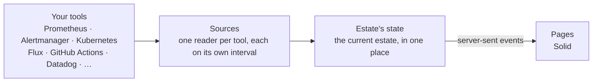
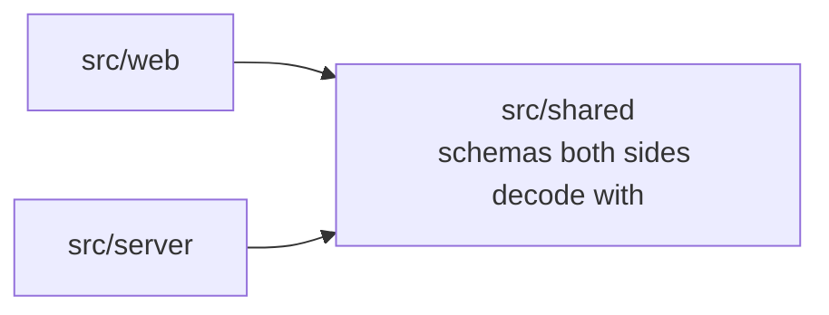

# Estate

[](https://github.com/matthewjones372/estate/actions/workflows/gate.yml)
[](https://github.com/matthewjones372/estate/pkgs/container/estate)


[](LICENSE)

Estate shows the state of a set of services on one page.

When something breaks in production, the information you need to look into it is usually spread across several
systems. An alert might be in Grafana, the logs in Elasticsearch, the deployment in GitHub or Jenkins, the workload in
Kubernetes, the owner in a service catalogue, the runbook in Confluence, and the people looking at it in Slack.

Estate reads those systems and shows what they say about each service on one page that updates as things change, with
links to each system for the detail.


## What it is for

Estate does not replace Grafana, Datadog, Elasticsearch, Kubernetes, GitHub or other tools, and it does not store
their data. If all your metrics, logs, deployments, incidents, owners and runbooks are already in one platform, you
probably don't need it.

It is meant for setups where teams use a mix of tools: one service on Prometheus and Grafana, another on Datadog or
CloudWatch, logs in Elasticsearch or Loki, deployments through GitHub Actions, Jenkins, Harness or Argo CD. Looking
into an alert in a setup like that often means going from the alert to metrics, logs, the latest deployment, the
repository, the owner, Slack and the runbook in turn.

For each service, Estate shows:

- alerts, thresholds, impact and history
- what changed: deployments, builds, alerts, silences and notes
- what's running, from Kubernetes and the deployment tool
- request rate, errors, latency and other signals
- the owning team, repository and contact details
- links to logs, dashboards, traces, runbooks and the source systems

### An example

Say an alert called `OrdersSlow` fires at 11:46. Its page in Estate shows:

- what's happening: a warning, firing for 14 minutes, and its impact (customers wait to place orders)
- what's around it: `orders`' new version stalled 20 minutes before the alert, because its image policy could not
  list tags; `orders-db` is healthy at 32% of its connections; there have been 128 "lock timeout on orders_items"
  errors since just before it fired; the runbook says to roll back if p99 rose after a deploy
- who owns it: the Orders team, with a link to their Slack channel
- if a model is configured, Ask AI gives a likely cause, the lines of the brief that support it, and what to do next

## What it brings together

| | |
|---|---|
| Alerts | Alertmanager, Grafana alerting, CloudWatch alarms, Datadog monitors |
| Metrics | Prometheus (or anything with its query API), Datadog, CloudWatch |
| Runtime | Kubernetes, ECS |
| Deploys | Flux, Argo CD, Harness CD, ECS deployments |
| Builds | GitHub Actions, GitLab CI, Jenkins, TeamCity, Harness CI |
| Logs | Loki, Datadog, Elasticsearch/OpenSearch, or pod logs straight from the cluster |
| AI agents | Runs, failures, tokens against a budget and the model in use, from the GenAI metrics they already send; recent runs from Langfuse |
| Costs | AWS Cost Explorer by tag, with forecasts and anomalies; OpenCost or Kubecost for what shares a cluster; Anthropic's and OpenAI's cost reports for agents |
| Code health | SonarQube's quality gate and coverage; GitHub's Dependabot and code scanning alerts |
| Notes, impact and alert history | Postgres, DynamoDB, or memory |

Where Grafana sits in front of Prometheus and Loki, Estate can reach them through Grafana with one service account
token instead of separate addresses and credentials. The same page works on other stacks, for example EKS with
Grafana's alerting, Argo CD and Elasticsearch, or an environment read entirely from Datadog and built by Jenkins.


Estate reads data from your tools each time it shows it and does not copy it. The only things it stores are what it
adds itself: notes, what an alert means, and each alert's past firings.

## What you can do from the page

- add a note to an alert so the next person knows someone's on it
- say what an alert means for the people using the product, kept for every time it fires
- see whether an alert has fired before, for how long, and what was written about it then
- silence an alert for a while, with a reason everyone can see
- turn on debug logging for a service for 15 minutes; it switches itself back off
- watch a service's logs live, filter them by level or text and pause them, or see its errors grouped by message
- read a service's load and stats over the last hour, six hours, day or week; point at a chart to read the same
  moment on every chart, and drag across one to zoom them all
- compare what's deployed in each environment
- open an alert's own page to share: what's happening, what is around it, who owns it
- ask AI about an alert, when a model is set in `estate.yaml`
- raise an incident in PagerDuty, Opsgenie or your own tool from the alert, when the catalog names its link
- tell the team that owns an alert in its Slack channel, once a firing; the card then links to the thread
- jump to any service, store, job or agent by name from the header, or with ⌘K (Ctrl K)
- see a service's version in every environment at once, and switch to one
- see what each service, job and agent costs this month against its budget; a cost anomaly or a budget it is on
  course to pass is flagged, and an agent's spend between its provider's reports is estimated from its tokens and
  marked as an estimate
- see each service's code health under its name: its quality gate, coverage and open security alerts, shown in amber
  when its owner should look, each linking to SonarQube or GitHub
- follow an AI agent's runs, failures and tokens against its daily budget, and open its recent runs
- see when a job last ran and when it runs next, and a store's stats over a day

Viewers see everything and add notes. Operators can also silence, switch debug, and write what an alert means.


Services, stores and jobs can be grouped by category, such as Payments or Data, so a page of forty services
can be read as five groups. The map at the top draws a node per category once there are more than a dozen, and opens one
in place when you click it. Anything that needs attention is always drawn on its own. The overview shows services as
lanes or, when the estate is long to scroll, as a grid of compact cards; the choice is kept in this browser.

### Around this alert, and Ask AI


An alert's own page collects related information without using AI: the deploys and builds of its service and of what
it calls or what calls it, from the hour before it fired; how those neighbours are, with their stats; its errors from
ten minutes before it fired, grouped by message; its earlier firings and what was written then; and its runbook's
text, where the runbook is a page Estate can read.

If a model is configured, Ask AI gives that brief to the model, which may call the same read tools agents use over
`/mcp` for what the brief does not say, and answers with the likely cause, the evidence for it, and what to do next.
The answer lists what it read and called, so the reader can check it. You can keep the answer as a note for
everyone to see. The model is sent only what the person asking could see on the page. There is at most one answer
per alert per minute, within a daily token budget.

```yaml
# estate.yaml: one model
ai: { provider: anthropic, apiKey: "${ANTHROPIC_API_KEY}", model: claude-opus-5-5, budget: { tokensPerDay: 500000 } }
# or provider: openai, xai or gemini with their key, or a self-hosted server that speaks OpenAI's API:
# ai: { provider: openai-compatible, url: http://vllm.internal:8000/v1, model: my-model }

# Credentials for reading runbooks' text, by the host their links name
runbooks:
  - { host: wiki.example.com, user: estate@example.com, token: "${WIKI_TOKEN}" }
```

### MCP for agents

Estate serves an [MCP](https://modelcontextprotocol.io) server at `/mcp`, so an AI agent such as Claude Code can read
the same information a person sees on the page. Access is read-only and uses Estate's own access to the tools. Each
agent has its own token.

```yaml
# estate.yaml
mcp:
  tokens:
    - { name: claude-code, token: "${ESTATE_MCP_TOKEN}", role: viewer }   # at least 32 characters
```

```bash
claude mcp add --transport http estate https://estate.example/mcp --header "Authorization: Bearer $ESTATE_MCP_TOKEN"
```

| Tool | Answers |
|---|---|
| `estate_now` | what needs someone in an environment, worst first |
| `services` | every service, store, job and agent: health, reasons, version, owner, category |
| `service` | one service: health, load, pods, deploy and builds, alerts, links, team |
| `alerts` | what is firing, pending and silenced, each with its impact, notes, silence and runbook |
| `alert_history` | an alert's earlier firings, with who silenced each and why, and the notes written then |
| `changes` | what changed today: deploys, builds, alerts, silences, notes and jobs, newest first |
| `errors` | a service's errors over an hour, six hours or a day, grouped by message, for a token whose role may read logs |
| `agents` | each AI agent's runs, failures, tokens against its budget and its model |
| `around_alert` | an alert's brief: what changed near it, what it depends on, its errors, history and runbook |

### Kiosk

`/kiosk` is meant for a wall screen. It shows the headline, what's firing and every service, worst first, in large
type and with no controls. Open `/kiosk?token=…` once on the screen; it signs in for 30 days and can
read but never change anything.


## Try it

```bash
docker run -v ./examples:/etc/estate -p 8080:8080 ghcr.io/matthewjones372/estate:main
```

Then open <http://localhost:8080>. The example points at tools that don't exist, so each part of the page says
what it couldn't reach. Edit `examples/estate.yaml` to point it at your own.

To see it with live data, [petshop's demo](https://github.com/matthewjones372/petshop/tree/main/demo) runs Estate
in Docker Compose against a real Prometheus and Alertmanager watching a small Kotlin service. Stopping the demo's
chip registry fires an alert, which appears at the top of the page and resolves once the registry is back. Its
`estate/` folder is a working `estate.yaml` and `catalog.yaml` to start from.

To try it against your team's real tools, set `readOnly: true` in `estate.yaml` so Estate writes nothing (no
silences, no debug switching, notes only in memory), then run the `doctor` command:

```bash
docker run -v ./my-estate:/etc/estate --env-file my-estate/.env ghcr.io/matthewjones372/estate:main doctor
```

It asks each tool once and prints a line per part: what answered, how many alerts matched a service, which services
have no running pods or no log lines, and which setting would fix it. [docs/real-tools.md](docs/real-tools.md) has the
settings for each tool, and what each line should say when it's right.

## Configure it

Estate reads two files from `/etc/estate`. `catalog.yaml` says what your estate is, and lives in Git, so adding a
service is a pull request:

```yaml
environments:
  - { name: production, sources: production }   # sources: which section of estate.yaml has its tools

teams:
  - name: payments
    title: Payments
    links: { slack: "https://example.slack.com/archives/C0PAY", oncall: "https://example.pagerduty.com/schedules/PPAY" }

services:
  - name: payments
    owner: payments
    category: Payments
    environments: [ production ]
    kubernetes: { namespace: shop, workloads: [ { kind: Deployment, name: payments } ] }
    deploy: { flux: { kustomization: shop, imagePolicy: payments } }
    build: { github: { workflow: payments.yml, branch: main } }
    load:
      requests: sum(rate(http_requests_total{app="payments"}[1m]))
      p99: histogram_quantile(0.99, sum by (le) (rate(http_request_duration_seconds_bucket{app="payments"}[5m])))
    links:
      logs: "https://grafana.example.com/explore?var-env={env}&var-service={service}"
      traces: "https://grafana.example.com/explore?var-service={service}"
      # Raise incident on its alerts' cards; Estate opens the tool, it does not create the incident
      incident: "https://example.pagerduty.com/incidents/create?service={service}&title={alert}"

alerts:
  PaymentsFailing: { impact: "Customers cannot pay; orders wait in their baskets." }
```

`estate.yaml` holds the settings: sign-in, roles, where each environment's tools are, and Estate's own database for its notes and history.
Secrets are written as `${NAME}` and read from the environment.

`estate check catalog.yaml` reports every mistake in one go, with where it is, so it fits in CI. Estate reloads the
catalog when it changes.

If most entries would look the same, a `discover:` rule in the catalog can have Estate find them instead. It
matches Deployments and StatefulSets by label selector and turns each into the entry the rule describes, taking the
owner and category from labels and the description, repository and runbook from `estate.dev/` annotations. Found
entries are checked the same way as written ones and marked "found in Kubernetes" on the page, which offers their YAML
to copy into the catalog. A written entry with the same name takes priority.

A `backstage:` rule does the same from Backstage's catalog. Each Component becomes a service, with its owner, its
system as category, description, links, and repository and namespace from the annotations Backstage's plugins use.
The Backstage address and token go in `estate.yaml`.

```yaml
discover:
  - kubernetes: { selector: estate.dev/show=true, namespaces: [ shop ] }
    service:
      owner: "{label:team}"
      category: "{label:app.kubernetes.io/part-of}"
      load: { requests: 'sum(rate(http_requests_total{app="{name}"}[1m]))' }
```
[`examples/catalog.yaml`](examples/catalog.yaml) uses every option, including stores, jobs no service owns, the map
and vitals.

## How it compares

Estate is used alongside these tools and links into each of them.

- Backstage, Port and Cortex catalog what you own. Estate shows its current state.
- Grafana can chart anything, but someone has to build and maintain the dashboards, and a dashboard does not know who
  owns a service, what was deployed before an alert, or what was written the last time it fired. Estate links to
  Grafana for detail.
- k9s, Lens and Headlamp show one cluster in depth. Estate covers several environments and links into them.
- Argo CD's UI and Weave GitOps show the deploy tool. Estate shows that next to the build and what's running.
- Karma and Keep handle alerts by themselves. Estate shows each alert next to the service it's about.

## Technical details

### Deployment

Images for amd64 and arm64 are published to `ghcr.io/matthewjones372/estate` from `main`. [`deploy/`](deploy) has a
Kubernetes base to overlay with your two files, an ingress and your secrets. It runs as one container in about
120 MB.

- Sign-in is OIDC with PKCE, with groups mapped to viewer and operator. Anonymous sign-in is available for trying it
  out.
- Health: `/healthz` says the process is up, and `/readyz` says every source has been read at least once.
- Estate's own telemetry: metrics on `:9464/metrics`, JSON logs, and traces over OTLP if you set a collector.

#### More than one replica

One replica is enough for most setups, since it restarts in about the time a failover takes. Run more if the tools'
rate limits are being hit, if losing a node must not blank the page, or if many kiosks outgrow one process. Set
`cluster: true` beside `database: { postgres: … }` and add the [`deploy/cluster`](deploy/cluster) component to your
overlay. Every replica serves the pages. Each environment is read by one replica, and Estate's own work (its catalog,
builds, notes and history) by one replica too, so the reading is spread between replicas and two replicas make the
same number of calls as one. A note or silence made on any replica shows on all of them. When a replica goes, the others take what it read
within a minute, and the pages keep the last state meanwhile. `/readyz` says what a replica reads and whom it follows
for the rest, and `estate doctor` names the runners and who reads the estate and each environment. [`examples/cluster`](examples/cluster) runs two on one
machine.

### Architecture



Each tool is a source behind a typed port, with a fake for tests. Sources do the talking, retries and timeouts.
Estate holds the current state, and each environment's views are built once and shared by every page watching it.
A new page receives a snapshot, then only what changes; a page that reconnects resumes from its `Last-Event-ID`.

The server uses [Effect](https://effect.website), because most of the work is remote calls that can fail, along
with retries, timeouts, schedules, concurrency and long-lived streams. With Effect, a tool being down is part of the
typed error model instead of an exception thrown somewhere in a request. The pages use
[Solid](https://www.solidjs.com), which redraws only what changed.



The server and the pages never import each other, and `shared` imports nothing of ours. Those boundaries are
checked on every build.

### Performance

Fifty services is about the most a team puts on one page, and the build fails if Estate gets slower at that size.
A thousand is a stress test. Both are measured by [`bench/`](bench) against fake tools that answer in 20 ms:

| | 50 services, 5 pages | 1,000 services, 20 pages |
|---|---|---|
| Calls to the tools a second | 11 | 101 |
| First data to a page | 0.1 MB | 2 MB |
| Estate's CPU | 3% of a core | 52% |
| Estate's memory | 136 MB | 174 MB |
| Page drawn | 0.5 s | 2.2 s |
| Clustered: whole estate to a follower | 186 KB | 3.7 MB |
| Clustered: changes to a follower a minute | 27 KB | 485 KB |

Every page watching an environment shares one stream, so more pages cost little. Each source is read on its own
interval, which `every:` lengthens for tools that limit or bill each call.

### Testing

```bash
bun install
bun run gate          # typecheck, lint, unused code, layering, slop, tests with coverage
bunx playwright test  # the pages in a browser against fake tools, with axe accessibility checks
bun run perf          # fifty services against the budgets
bun run integration   # Estate's readers against the real tools in containers: needs Docker
```

A change is not done until the gate passes. The gate runs strict TypeScript, Biome, Knip,
dependency-cruiser, and the tests, which must cover 90% of the lines in every file. It also refuses `any`, non-null assertions,
`console`, TODOs, commented-out code, skipped tests, files over 300 lines, rules switched off inline, and running an
Effect inside application code. The same gate is the agent's stop hook. `bun run integration` runs the readers
against real Prometheus, Alertmanager, Grafana, Loki, Elasticsearch, Postgres, DynamoDB, Jenkins, LocalStack and
Kubernetes.

[AGENTS.md](AGENTS.md) covers code conventions. Every change starts as a spec in [specs/](specs).

### Design principles

- The state of each service should be visible on one page, without opening several dashboards.
- Estate is not a system of record. Prometheus holds metrics, Alertmanager holds alerts, Kubernetes holds workloads
  and Git holds configuration. Estate reads from them.
- The catalog is written explicitly and reviewed in Git. It can ask for services to be discovered, and anything
  written in it takes priority.
- When a source stops answering, the page says which one and since when, instead of showing old data as if it were
  current.
- The integration work happens once on the server for every page, so the browser code stays simple.
- Reading and changing are separate, and every change records who made it and why.

## License

[MIT](LICENSE)
