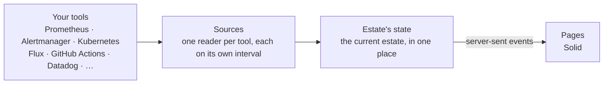
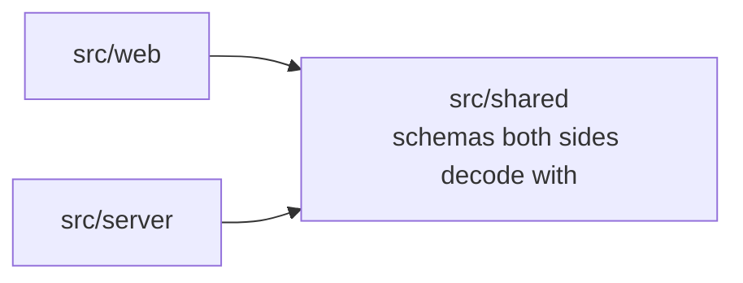

# Estate

[](https://github.com/matthewjones372/estate/actions/workflows/gate.yml)
[](https://github.com/matthewjones372/estate/pkgs/container/estate)


[](LICENSE)

**An operational context layer for your engineering estate.**

Estate is not a Grafana replacement, and it is not trying to be another dashboard. When an alert fires, the problem
is rarely a missing chart — it is that the context is scattered: the alert in one tool, the deploy in another, the
runbook in a third, ownership in the catalogue, the people in Slack.

**Estate's path is ALERT → CONTEXT → INVESTIGATION.** It puts what is firing first, correlates what changed near it,
names who owns it, and links you into the system that has the detail.


## Why does Estate exist?

Estate is an **operational context layer**, not another observability platform. It does **not** replace Grafana,
Datadog, Elasticsearch, Kubernetes, GitHub or your other engineering tools — and it is deliberately not a place to
build boards.

If your entire engineering estate is already standardised around one platform, with metrics, logs, deployments,
incidents, ownership and runbooks all integrated into it, you probably don't need Estate.

Real estates accumulate tools. One service uses Prometheus and Grafana; another Datadog; logs sit in Elasticsearch or
Loki; deploys run through GitHub Actions, Jenkins, Harness or Argo CD. Those tools are good at their jobs. The gaps
between them are where incidents get expensive.

### A concrete morning

> **11:46** — `OrdersSlow` fires. Instead of opening five tabs, you open the alert in Estate.
>
> **What's happening** — warning, firing 14 minutes, customers wait to place orders.
> **What changed** — `storefront` `main-88-04bc441` deployed 2 minutes before it fired (Flux); payments unchanged.
> **Who owns it** — web · Orders on Slack.
> **Where to look** — runbook, logs, traces, the service page.
> **Ask AI** (optional) — reads the same brief, answers with likely cause, evidence links, runbook next steps and
> confidence — and never invents what Estate did not see.

That is ALERT → CONTEXT → INVESTIGATION. Estate reads your tools live and keeps only what it adds: notes, impact, and
alert history.

## What it brings together

| | |
|---|---|
| Alerts | Alertmanager, Grafana alerting, CloudWatch alarms, Datadog monitors |
| Metrics | Prometheus (or anything with its query API), Datadog, CloudWatch |
| Runtime | Kubernetes, ECS |
| Deploys | Flux, Argo CD, Harness CD, ECS deployments |
| Builds | GitHub Actions, GitLab CI, Jenkins, TeamCity, Harness CI |
| Logs | Loki, Datadog, Elasticsearch/OpenSearch, or pod logs straight from the cluster |
| AI agents | Runs, failures, tokens against a budget and the model in use, from the GenAI metrics they already send; recent runs from Langfuse |
| Notes, impact and alert history | Postgres, DynamoDB, or memory |

Where Grafana sits in front of Prometheus and Loki, Estate reaches them through Grafana with one service account
token, rather than with addresses and credentials of their own. The same page works on other stacks: EKS with
Grafana's alerting, Argo CD and Elasticsearch, or an environment read wholly from Datadog and built by Jenkins.


> **Read, don't store.** Your tools own their data. Estate reads it live each time it shows it. It keeps only what
> it adds: notes, what an alert means, and each alert's past firings.

## What you can do from the page

- add a note to an alert so the next person knows someone's on it
- say what an alert means for the people using the product, kept for every time it fires
- see whether an alert has fired before, for how long, and what was written about it then
- silence an alert for a while, with a reason everyone can see
- turn on debug logging for a service for 15 minutes; it switches itself back off
- watch a service's logs live, or see its errors grouped by message
- compare what's deployed in each environment
- ask AI about an alert when `ai` is set in `estate.yaml` (Anthropic, OpenAI, xAI/Grok, Gemini, or any OpenAI-compatible server)

Viewers see everything and add notes. Operators can also silence, switch debug, and write what an alert means.


Services, stores and jobs can be grouped by **category**, such as Payments or Data, so a page of forty services
reads as five areas. The map at the top draws a node per category once there are more than a dozen, and opens one
in place when you click it. Anything that needs someone is always drawn on its own. On the overview, switch services between **List** (lanes) and **Grid** (compact cards) when the estate is long to scroll; the choice is kept in this browser.

### Also: a screen on the wall

`/kiosk` is optional wall-display mode — headline and what's firing, large type, nothing to press. Useful on a NOC
TV; not the main product. Open `/kiosk?token=…` once; it signs in for 30 days and never changes anything.


## Try it

```bash
docker run -v ./examples:/etc/estate -p 8080:8080 ghcr.io/matthewjones372/estate:main
```

Then open <http://localhost:8080>. The example points at tools that don't exist, so each part of the page tells you
what it couldn't reach. Edit `examples/estate.yaml` to point it at your own.

To try it against your team's real tools, set `readOnly: true` in `estate.yaml` so Estate writes nothing (no
silences, no debug switching, notes only in memory), then ask the doctor:

```bash
docker run -v ./my-estate:/etc/estate --env-file my-estate/.env ghcr.io/matthewjones372/estate:main doctor
```

It asks each tool once and prints a line per part: what answered, how many alerts matched a service, which services
have no running pods or no log lines, and which setting would fix it. [docs/real-tools.md](docs/real-tools.md) has the
settings for each tool, and what each line should say when it's right.

## Configure it

Estate reads two files from `/etc/estate`. `catalog.yaml` says what your estate is, and lives in Git, so adding a
service is a pull request:

```yaml
environments:
  - { name: production, sources: production }   # sources: which section of estate.yaml has its tools

teams:
  - name: payments
    title: Payments
    links: { slack: "https://example.slack.com/archives/C0PAY", oncall: "https://example.pagerduty.com/schedules/PPAY" }

services:
  - name: payments
    owner: payments
    category: Payments
    environments: [ production ]
    kubernetes: { namespace: shop, workloads: [ { kind: Deployment, name: payments } ] }
    deploy: { flux: { kustomization: shop, imagePolicy: payments } }
    build: { github: { workflow: payments.yml, branch: main } }
    load:
      requests: sum(rate(http_requests_total{app="payments"}[1m]))
      p99: histogram_quantile(0.99, sum by (le) (rate(http_request_duration_seconds_bucket{app="payments"}[5m])))
    links:
      logs: "https://grafana.example.com/explore?var-env={env}&var-service={service}"
      traces: "https://grafana.example.com/explore?var-service={service}"

alerts:
  PaymentsFailing: { impact: "Customers cannot pay; orders wait in their baskets." }
```

`estate.yaml` holds the settings: sign-in, roles, where each environment's tools are, and where to keep notes.
Secrets are written as `${NAME}` and read from the environment.

`estate check catalog.yaml` reports every mistake in one go, with where it is, so it fits in CI. Estate reloads the
catalog when it changes. There is deliberately no automatic discovery: the catalog is explicit and reviewed.
[`examples/catalog.yaml`](examples/catalog.yaml) uses every option, including stores, jobs no service owns, the map
and vitals.

## How it compares

Estate sits beside these tools, not instead of them, and links into each.

- **Backstage, Port, Cortex** catalog what you own. Estate shows how it's doing right now.
- **Grafana** is for charts and boards you build and maintain. Estate is not a Grafana replacement; it links into Grafana (and others) when you need the deep dive.
- **k9s, Lens, Headlamp** go deep on one cluster. Estate covers several environments and links into them.
- **Argo CD's UI, Weave GitOps** show the deploy tool. Estate puts that next to the build and what's running.
- **Karma, Keep** handle alerts on their own. Estate shows each one next to the service it's about.

## Technical details

### Deployment

Images for amd64 and arm64 are published to `ghcr.io/matthewjones372/estate` from `main`. [`deploy/`](deploy) has a
Kubernetes base to overlay with your two files, an ingress and your secrets. It runs as one container in about
120 MB.

- **Sign-in** is OIDC with PKCE, groups mapped to viewer and operator. Anonymous sign-in is there for trying it out.
- **Health**: `/healthz` says the process is up, and `/readyz` says every source has been read at least once.
- **Its own telemetry**: metrics on `:9464/metrics`, JSON logs, and traces over OTLP if you set a collector.

### Architecture



Each tool is a **source** behind a typed port, with a fake for tests. Sources do the talking, retries and timeouts.
Estate holds the current state, and each environment's views are built once and shared by every page watching it.
A new page receives a snapshot, then only what changes; a page that reconnects resumes from its `Last-Event-ID`.

The server is [Effect](https://effect.website), because the work is remote calls that fail, retries, timeouts,
schedules, concurrency and long-lived streams. With Effect, a tool being down is part of the typed error model, not
an exception somewhere in a request. The pages are [Solid](https://www.solidjs.com), redrawing only what changed.



The server and the pages never import each other, and `shared` imports nothing of ours. Those boundaries are
checked on every build.

### Performance (secondary)

Fifty is about the most a team puts on one page, and the build fails if Estate gets slower there. A thousand is a
stress test. Both are measured by [`bench/`](bench) against fake tools that answer in 20 ms:

| | 50 services, 5 pages | 1,000 services, 20 pages |
|---|---|---|
| Calls to the tools a second | 11 | 101 |
| First data to a page | 0.1 MB | 2 MB |
| Estate's CPU | 3% of a core | 52% |
| Estate's memory | 136 MB | 174 MB |
| Page drawn | 0.5 s | 2.2 s |

Every page watching an environment shares one stream, so more pages cost little. Each source is read on its own
interval, which `every:` lengthens for tools that limit or bill each call.

### Testing

```bash
bun install
bun run gate          # typecheck, lint, unused code, layering, slop, tests with coverage
bunx playwright test  # the pages in a browser against fake tools, with axe accessibility checks
bun run perf          # fifty services against the budgets
bun run integration   # Estate's readers against the real tools in containers: needs Docker
```

**If it isn't passing the gate, it isn't finished.** The gate runs strict TypeScript, Biome, Knip,
dependency-cruiser, and the tests, which must cover 90% of the lines in every file. It also refuses `any`, non-null assertions,
`console`, TODOs, commented-out code, skipped tests, files over 300 lines, rules switched off inline, and running an
Effect inside application code. The same gate is the agent's stop hook. `bun run integration` runs the readers
against real Prometheus, Alertmanager, Grafana, Loki, Elasticsearch, Postgres, DynamoDB, Jenkins, LocalStack and
Kubernetes.

[AGENTS.md](AGENTS.md) covers code conventions. Every change starts as a spec in [specs/](specs).

### Design principles

- **One operational view.** The state of the estate should be obvious without opening six dashboards.
- **Not another system of record.** Prometheus owns metrics, Alertmanager owns alerts, Kubernetes owns workloads,
  Git owns configuration. Estate combines them.
- **Configuration over discovery.** The catalog is explicit and reviewable in Git.
- **Fail explicitly.** Tools go down, tokens expire, APIs change. When a source stops answering, the page says which
  and since when, rather than showing stale data as if it were current.
- **Keep the browser simple.** The integration work happens on the server, once, for every page.
- **Make changes obvious.** Reading and changing are separate, and every change says who made it and why.

## License

[MIT](LICENSE)
