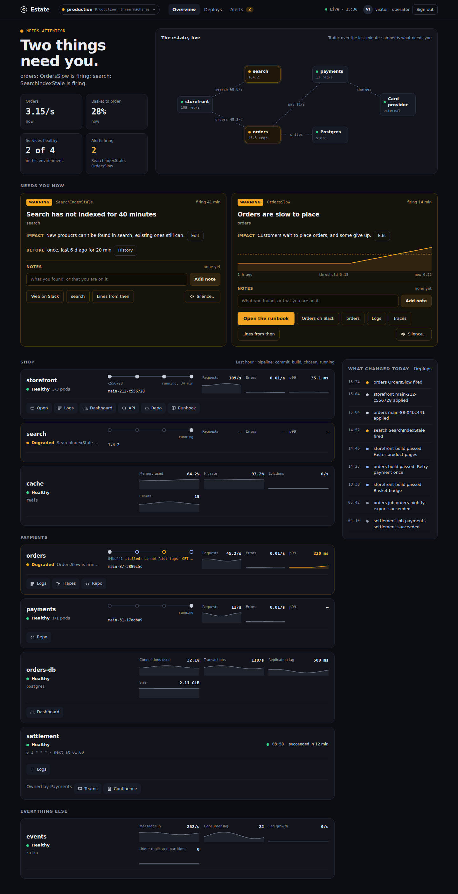
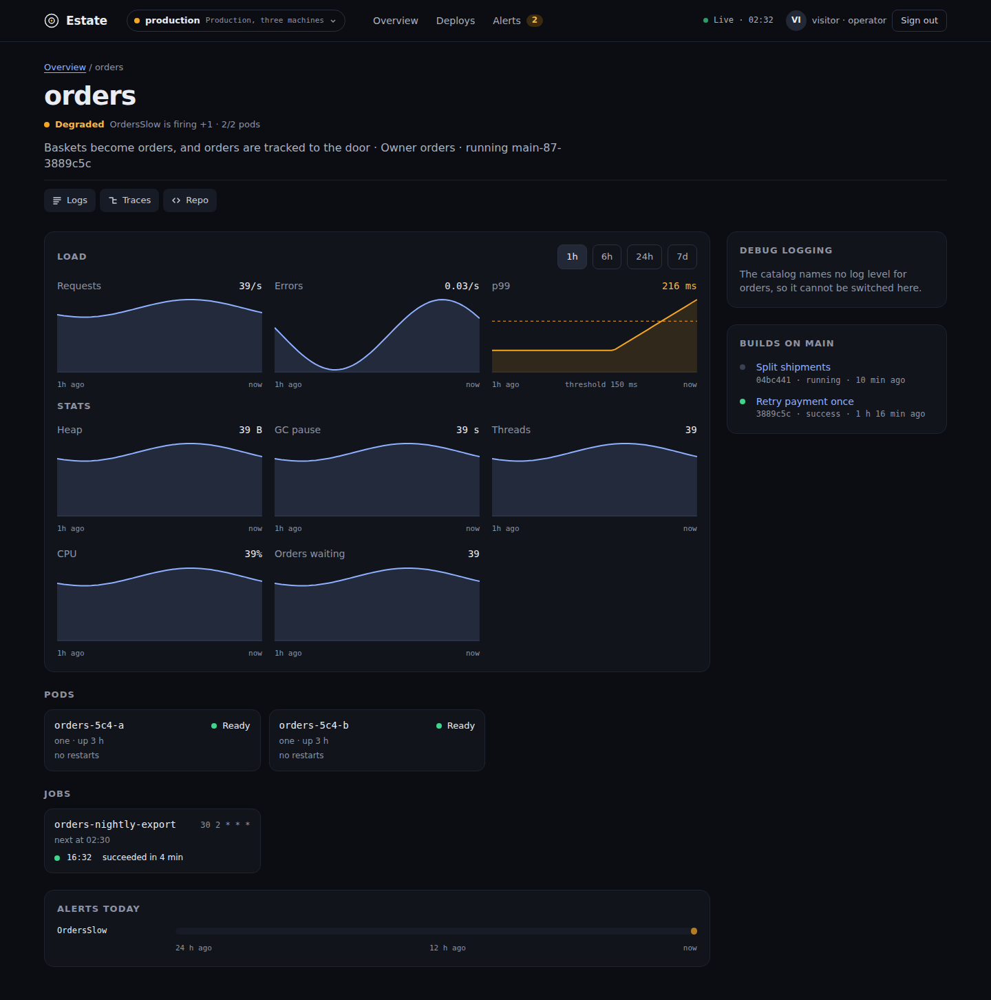

# Estate

[](https://github.com/matthewjones372/estate/actions/workflows/gate.yml)
[](https://github.com/matthewjones372/estate/pkgs/container/estate)


[](LICENSE)

Estate is a single page that shows the state of your services across environments: what's alerting, what's
deployed where, how busy things are, and what changed today. It doesn't store any of that. It reads it from the tools
you already run and puts it in one place.



## What it reads

| | |
|---|---|
| Alerts | Alertmanager, Grafana alerting, CloudWatch alarms, Datadog monitors |
| Metrics | Prometheus (or anything with its query API), Datadog, CloudWatch |
| Runtime | Kubernetes, ECS |
| Deploys | Flux, Argo CD, ECS deployments |
| Builds | GitHub Actions, GitLab CI, Jenkins |
| Logs | Loki, Datadog, Elasticsearch/OpenSearch, or pod logs straight from the cluster |
| Notes | Postgres, DynamoDB, or memory |

Where Grafana sits in front of Prometheus and Loki, Estate can reach them through Grafana's data source proxy with
one service account token, rather than with addresses and credentials of their own.

## What's on the page

The overview starts with whatever is firing, each alert drawn against its threshold with a link to its runbook.
Below that, each service gets a row: health, the path from commit to build to deployed version, the last hour of
requests, errors and p99, and links to its logs, traces and dashboards. Databases, queues and caches get rows too,
using stats from the exporters you probably already have (Postgres, CloudNativePG, MySQL, Redis, Kafka).

From the page you can:

- add a note to an alert so the next person knows someone's on it
- silence an alert for a while, with a reason everyone can see
- turn on debug logging for a service for 15 minutes; it switches itself back off
- watch a service's logs live, or see its errors grouped by message
- compare what's deployed in each environment

For a screen on the wall there is `/kiosk`: the headline, what's firing and every service worst first, in type you
can read across a room, with nothing to press. Set `kiosk.token` and open `/kiosk?token=…` once on the screen; it
signs in for 30 days and can read but never change anything. Environments take turns, `?team=payments` shows only
the services that team owns, and if the screen stops hearing from Estate it says so in red.



## Why it's built this way

It runs as one container using about 120 MB. Since it reads everything live, there's nothing to back up. The only
thing it keeps is notes, and only if you give it a database.

What it shows comes from a `catalog.yaml` in your repo, so adding a service is a pull request. `estate check
catalog.yaml` validates the file, so you can run it in CI.

The page updates over server-sent events and redraws only what changed. If a source stops answering, the page says
which one and when it last heard from it, rather than showing stale data as if it were current.

Sign-in is OIDC. Viewers can see everything and add notes; operators can also silence alerts and switch debug
logging. With impersonation turned on, debug changes go to the cluster as the person who made them.

Estate exposes its own metrics on `:9464/metrics`, logs JSON, and sends traces over OTLP if you configure a collector.

### How it compares

- **Backstage, Port, Cortex** catalog what you own. Estate shows how it's doing right now.
- **Grafana** can chart anything, but someone has to build and maintain the boards. Estate needs none.
- **k9s, Lens, Headlamp** go deep on one cluster. Estate covers several environments and links into them.
- **Argo CD's UI, Weave GitOps** show the deploy tool. Estate puts that next to the build and what's running.
- **Karma, Keep** handle alerts on their own. Estate shows each one next to the service it's about.

## Try it

```bash
docker run -v ./examples:/etc/estate -p 8080:8080 ghcr.io/matthewjones372/estate:main
```

Then open <http://localhost:8080>. The example points at tools that don't exist, so each part of the page tells you
what it couldn't reach. Edit `examples/estate.yaml` to point it at your own.

To try it against your team's real tools, set `readOnly: true` in `estate.yaml` so Estate can't write anything (no
silences, no debug switching, notes only in memory), then run:

```bash
docker run -v ./my-estate:/etc/estate --env-file my-estate/.env ghcr.io/matthewjones372/estate:main doctor
```

It asks each tool once and prints a line per part: what answered, how many alerts matched a service, which services
have no running pods or no log lines, and which setting would fix it. It exits non-zero if anything failed. Tokens referenced as `${NAME}` in `estate.yaml` come
from the env file.

## Running it

Estate reads two files from `/etc/estate`:

- `catalog.yaml` describes your environments and services. [`examples/catalog.yaml`](examples/catalog.yaml) uses
  every option.
- `estate.yaml` holds settings: sign-in, roles, where each environment's tools are, and where to keep notes. Secrets
  can be written as `${NAME}` and are read from the environment.

Images for amd64 and arm64 are published to `ghcr.io/matthewjones372/estate` from `main`. [`deploy/`](deploy) has a
Kubernetes base you can overlay with those two files, an ingress and your secrets.

## How many services

Fifty is about the most a team puts on one page, and the build fails if Estate gets slower there. A thousand is a
stress test. Both are measured by [`bench/`](bench) against fake tools that answer in 20 ms, two environments, each
service with three load queries, a Deployment and a Flux image policy:

| | 50 services, 5 pages | 1,000 services, 20 pages |
|---|---|---|
| Calls to the tools a second | 11 | 101 |
| First data to a page | 0.1 MB | 2 MB |
| Data to a page a minute, once loaded | 0.02 MB | 0.01 MB |
| Estate's CPU | 3% of a core | 52% |
| Estate's memory | 136 MB | 174 MB |
| Page drawn | 0.4 s | 2.2 s |
| Page's heap | 8 MB | 88 MB |

Every page watching an environment shares one stream of its views, so more pages cost little. Each source is read
on its own interval, which `every:` in `estate.yaml` lengthens for tools that limit or bill each call.

```bash
bun bench/run.ts 1000 20   # services, pages
```

## Development

The server is TypeScript on Bun using [Effect](https://effect.website); the pages use
[Solid](https://www.solidjs.com).

```bash
bun install
bun run gate          # typecheck, lint, unused code, layering, tests
bunx playwright test  # browser tests against fake tools in e2e/
bun run perf          # fifty services against the budgets in bench/run.ts
```

[AGENTS.md](AGENTS.md) covers code conventions. Design decisions are written up in [specs/](specs).

## License

[MIT](LICENSE)
