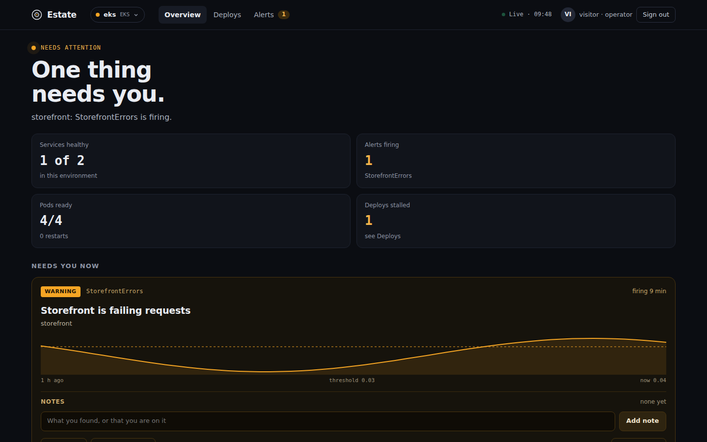
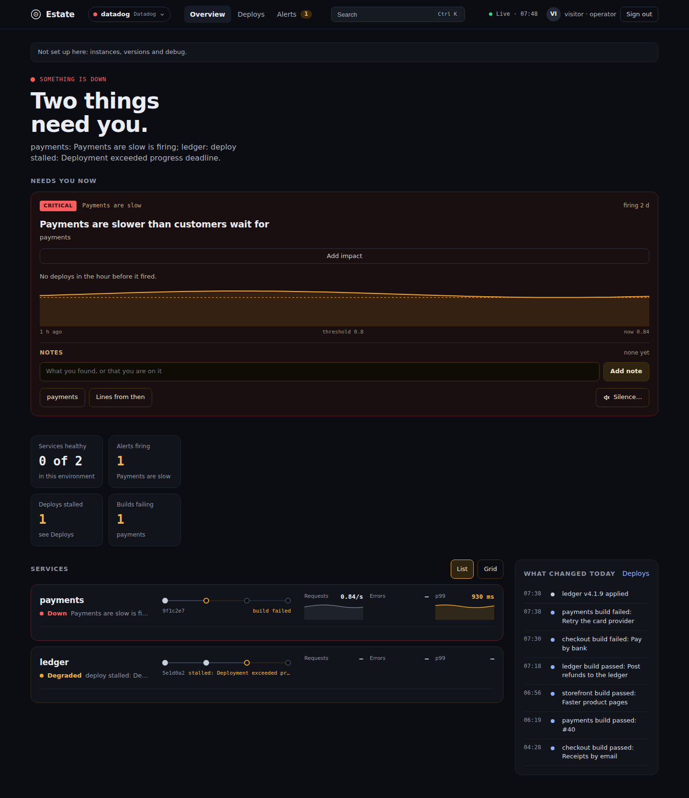
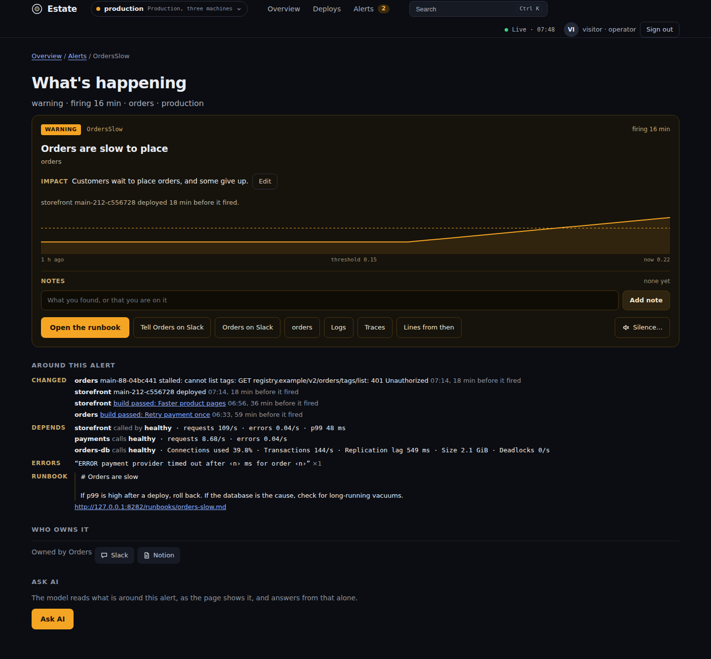
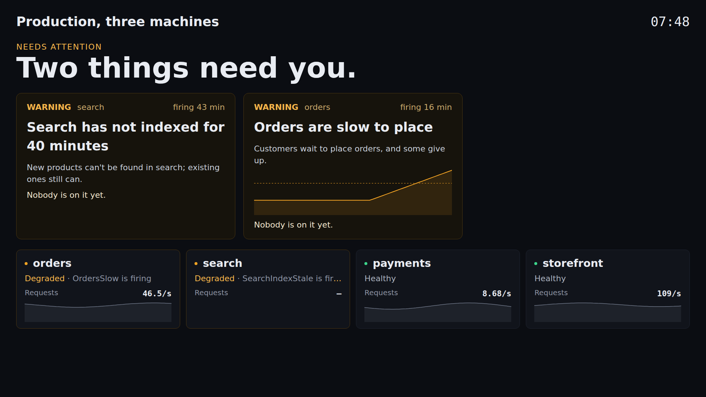
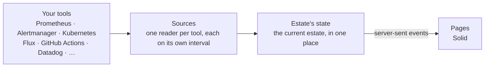
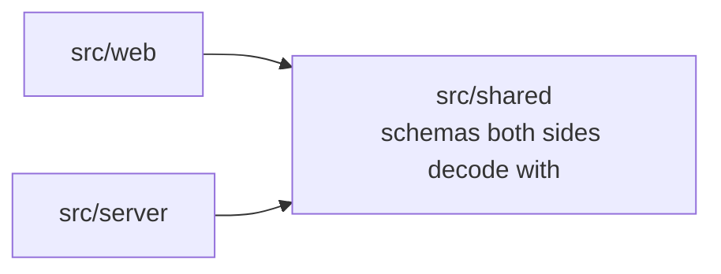

# Estate

[](https://github.com/matthewjones372/estate/actions/workflows/gate.yml)
[](https://github.com/matthewjones372/estate/pkgs/container/estate)


[](LICENSE)

**A control room for your engineering estate.**

When something breaks in production, the problem usually isn't a lack of telemetry. It's that the context you need
is spread across several systems.

An alert might be in Grafana. The useful logs might be in Elasticsearch. The deployment is in GitHub or Jenkins. The
workload is in Kubernetes. Ownership is in your service catalogue. The runbook is in Confluence. The people
investigating it are in Slack.

**Estate puts that context together on one live page for each service, then takes you to the system that has the
detail.**


## Why does Estate exist?

Estate is not another observability platform, and it isn't trying to replace Grafana, Datadog, Elasticsearch,
Kubernetes, GitHub or your other engineering tools.

If your entire engineering estate has already been standardised around one platform, with your metrics, logs,
deployments, incidents, ownership and runbooks all integrated into it, you probably don't need Estate.

Real engineering estates are often different. Teams accumulate tools over time. One service might use Prometheus and
Grafana, another Datadog, another CloudWatch. Logs might live in Elasticsearch or Loki. Deployments might run through
GitHub Actions, Jenkins, Harness or Argo CD. Kubernetes tells you what is running, while Slack, Confluence and your
service catalogue contain the human context.

Those tools are good at their individual jobs. The problem is the gaps between them. When an alert fires, the
investigation often looks like this:

> Alert → metrics → logs → recent deployment → repository → ownership → Slack → runbook

Estate turns that investigation into a single starting point. For each service, it brings together:

- **What's wrong?** Alerts, thresholds, impact and history
- **What changed?** Deployments, builds, alerts, silences and notes
- **What's running?** Kubernetes and deployment state
- **How is it behaving?** Request rate, errors, latency and supporting signals
- **Who owns it?** Team, repository and contact information
- **Where do I look next?** Logs, dashboards, traces, runbooks and source systems

Estate doesn't ingest your entire estate into another platform. It reads the systems you already use and provides
the missing context between them.

That's the job of Estate: **something's wrong. What do I need to know, and where do I look next?**

### A morning with Estate

> **11:46**: `OrdersSlow` fires. You open the alert in Estate rather than five tabs.
>
> **What's happening**: warning, firing for 14 minutes; customers wait to place orders.
> **Around this alert**: `orders`' new version stalled 20 minutes before it fired, its image policy unable to list
> tags; `orders-db` healthy at 32% of its connections; 128 "lock timeout on orders_items" errors since just before
> it fired; the runbook says to roll back if p99 rose after a deploy.
> **Who owns it**: Orders, with their Slack channel one click away.
> **Ask AI** (when a model is set): the likely cause, the lines of the brief that show it, and what to do next.

## What it brings together

| | |
|---|---|
| Alerts | Alertmanager, Grafana alerting, CloudWatch alarms, Datadog monitors |
| Metrics | Prometheus (or anything with its query API), Datadog, CloudWatch |
| Runtime | Kubernetes, ECS |
| Deploys | Flux, Argo CD, Harness CD, ECS deployments |
| Builds | GitHub Actions, GitLab CI, Jenkins, TeamCity, Harness CI |
| Logs | Loki, Datadog, Elasticsearch/OpenSearch, or pod logs straight from the cluster |
| AI agents | Runs, failures, tokens against a budget and the model in use, from the GenAI metrics they already send; recent runs from Langfuse |
| Costs | AWS Cost Explorer by tag, with forecasts and anomalies; OpenCost or Kubecost for what shares a cluster; Anthropic's and OpenAI's cost reports for agents |
| Notes, impact and alert history | Postgres, DynamoDB, or memory |

Where Grafana sits in front of Prometheus and Loki, Estate reaches them through Grafana with one service account
token, rather than with addresses and credentials of their own. The same page works on other stacks: EKS with
Grafana's alerting, Argo CD and Elasticsearch, or an environment read wholly from Datadog and built by Jenkins.




> **Read, don't store.** Your tools own their data. Estate reads it live each time it shows it. It keeps only what
> it adds: notes, what an alert means, and each alert's past firings.

## What you can do from the page

- add a note to an alert so the next person knows someone's on it
- say what an alert means for the people using the product, kept for every time it fires
- see whether an alert has fired before, for how long, and what was written about it then
- silence an alert for a while, with a reason everyone can see
- turn on debug logging for a service for 15 minutes; it switches itself back off
- watch a service's logs live, filter them by level or text and pause them, or see its errors grouped by message
- read a service's load and stats over the last hour, six hours, day or week; point at a chart to read the same
  moment on every chart, and drag across one to zoom them all
- compare what's deployed in each environment
- open an alert's own page to share: what's happening, what is around it, who owns it
- ask AI about an alert, when a model is set in `estate.yaml`
- raise an incident in PagerDuty, Opsgenie or your own tool from the alert, when the catalog names its link
- tell the team that owns an alert in its Slack channel, once a firing; the card then links to the thread
- jump to any service, store, job or agent by name from the header, or with ⌘K (Ctrl K)
- see a service's version in every environment at once, and switch to one
- see what each service, job and agent costs this month against its budget; an anomaly or a budget it will pass
  needs someone, and an agent's spend between its provider's reports is estimated from its tokens, and says so
- follow an AI agent's runs, failures and tokens against its daily budget, and open its recent runs
- see when a job last ran and when it runs next, and a store's stats over a day

Viewers see everything and add notes. Operators can also silence, switch debug, and write what an alert means.


Services, stores and jobs can be grouped by **category**, such as Payments or Data, so a page of forty services
reads as five areas. The map at the top draws a node per category once there are more than a dozen, and opens one
in place when you click it. Anything that needs someone is always drawn on its own. The overview shows services as
lanes or, when the estate is long to scroll, as a grid of compact cards; the choice is kept in this browser.

### Around this alert, and Ask AI



An alert's own page gathers what is around it, with no AI needed: the deploys and builds of its service and of what
it calls or what calls it, from the hour before it fired; how those neighbours are, with their stats; its errors from
ten minutes before it fired, grouped by message; its earlier firings and what was written then; and its runbook's
text, where the runbook is a page Estate can read.

With a model set, **Ask AI** gives that brief to the model, which may call the same read tools agents use over
`/mcp` for what the brief does not say, and answers with the likely cause, the evidence for it, and what to do next.
The answer lists what it read and called, so whoever reads it can check the working. Keep the answer as a note and everyone sees it. The model is sent only what
the person asking could see on the page, one answer an alert a minute, within a budget of tokens a day.

```yaml
# estate.yaml: one model
ai: { provider: anthropic, apiKey: "${ANTHROPIC_API_KEY}", model: claude-opus-5-5, budget: { tokensPerDay: 500000 } }
# or provider: openai, xai or gemini with their key, or a self-hosted server that speaks OpenAI's API:
# ai: { provider: openai-compatible, url: http://vllm.internal:8000/v1, model: my-model }

# Credentials for reading runbooks' text, by the host their links name
runbooks:
  - { host: wiki.example.com, user: estate@example.com, token: "${WIKI_TOKEN}" }
```

### MCP for agents

Estate serves an [MCP](https://modelcontextprotocol.io) server at `/mcp`, so an AI agent such as Claude Code reads
the same estate a person sees on the page, read-only, with Estate's access. Each agent has its own token.

```yaml
# estate.yaml
mcp:
  tokens:
    - { name: claude-code, token: "${ESTATE_MCP_TOKEN}", role: viewer }   # at least 32 characters
```

```bash
claude mcp add --transport http estate https://estate.example/mcp --header "Authorization: Bearer $ESTATE_MCP_TOKEN"
```

| Tool | Answers |
|---|---|
| `estate_now` | what needs someone in an environment, worst first |
| `services` | every service, store, job and agent: health, reasons, version, owner, category |
| `service` | one service: health, load, pods, deploy and builds, alerts, links, team |
| `alerts` | what is firing, pending and silenced, each with its impact, notes, silence and runbook |
| `alert_history` | an alert's earlier firings, with who silenced each and why, and the notes written then |
| `changes` | what changed today: deploys, builds, alerts, silences, notes and jobs, newest first |
| `errors` | a service's errors over an hour, six hours or a day, grouped by message, for a token whose role may read logs |
| `agents` | each AI agent's runs, failures, tokens against its budget and its model |
| `around_alert` | an alert's brief: what changed near it, what it depends on, its errors, history and runbook |

### A screen on the wall

`/kiosk` is for the screen on the wall: the headline, what's firing and every service worst first, in type you can
read across a room, with nothing to press. Open `/kiosk?token=…` once on the screen; it signs in for 30 days and can
read but never change anything.



## Try it

```bash
docker run -v ./examples:/etc/estate -p 8080:8080 ghcr.io/matthewjones372/estate:main
```

Then open <http://localhost:8080>. The example points at tools that don't exist, so each part of the page tells you
what it couldn't reach. Edit `examples/estate.yaml` to point it at your own.

To try it against your team's real tools, set `readOnly: true` in `estate.yaml` so Estate writes nothing (no
silences, no debug switching, notes only in memory), then ask the doctor:

```bash
docker run -v ./my-estate:/etc/estate --env-file my-estate/.env ghcr.io/matthewjones372/estate:main doctor
```

It asks each tool once and prints a line per part: what answered, how many alerts matched a service, which services
have no running pods or no log lines, and which setting would fix it. [docs/real-tools.md](docs/real-tools.md) has the
settings for each tool, and what each line should say when it's right.

## Configure it

Estate reads two files from `/etc/estate`. `catalog.yaml` says what your estate is, and lives in Git, so adding a
service is a pull request:

```yaml
environments:
  - { name: production, sources: production }   # sources: which section of estate.yaml has its tools

teams:
  - name: payments
    title: Payments
    links: { slack: "https://example.slack.com/archives/C0PAY", oncall: "https://example.pagerduty.com/schedules/PPAY" }

services:
  - name: payments
    owner: payments
    category: Payments
    environments: [ production ]
    kubernetes: { namespace: shop, workloads: [ { kind: Deployment, name: payments } ] }
    deploy: { flux: { kustomization: shop, imagePolicy: payments } }
    build: { github: { workflow: payments.yml, branch: main } }
    load:
      requests: sum(rate(http_requests_total{app="payments"}[1m]))
      p99: histogram_quantile(0.99, sum by (le) (rate(http_request_duration_seconds_bucket{app="payments"}[5m])))
    links:
      logs: "https://grafana.example.com/explore?var-env={env}&var-service={service}"
      traces: "https://grafana.example.com/explore?var-service={service}"
      # Raise incident on its alerts' cards; Estate opens the tool, it does not create the incident
      incident: "https://example.pagerduty.com/incidents/create?service={service}&title={alert}"

alerts:
  PaymentsFailing: { impact: "Customers cannot pay; orders wait in their baskets." }
```

`estate.yaml` holds the settings: sign-in, roles, where each environment's tools are, and Estate's own database for its notes and history.
Secrets are written as `${NAME}` and read from the environment.

`estate check catalog.yaml` reports every mistake in one go, with where it is, so it fits in CI. Estate reloads the
catalog when it changes.

Where most entries would be written the same way, a `discover:` rule in the catalog has Estate find them instead: the
Deployments and StatefulSets a label selector matches, each made the entry the rule describes, its owner and category
from labels, its description, repository and runbook from `estate.dev/` annotations. Each is checked as a written entry
is and marked "found in Kubernetes" on the page, which offers its YAML to copy into the catalog; a written entry of the
same name wins.

```yaml
discover:
  - kubernetes: { selector: estate.dev/show=true, namespaces: [ shop ] }
    service:
      owner: "{label:team}"
      category: "{label:app.kubernetes.io/part-of}"
      load: { requests: 'sum(rate(http_requests_total{app="{name}"}[1m]))' }
```
[`examples/catalog.yaml`](examples/catalog.yaml) uses every option, including stores, jobs no service owns, the map
and vitals.

## How it compares

Estate sits beside these tools, not instead of them, and links into each.

- **Backstage, Port, Cortex** catalog what you own. Estate shows how it's doing right now.
- **Grafana** can chart anything, but someone has to build and maintain the boards, and a board does not know who
  owns a service, what was deployed before an alert, or what was written the last time it fired. Estate links into
  Grafana for the deep dive.
- **k9s, Lens, Headlamp** go deep on one cluster. Estate covers several environments and links into them.
- **Argo CD's UI, Weave GitOps** show the deploy tool. Estate puts that next to the build and what's running.
- **Karma, Keep** handle alerts on their own. Estate shows each one next to the service it's about.

## Technical details

### Deployment

Images for amd64 and arm64 are published to `ghcr.io/matthewjones372/estate` from `main`. [`deploy/`](deploy) has a
Kubernetes base to overlay with your two files, an ingress and your secrets. It runs as one container in about
120 MB.

- **Sign-in** is OIDC with PKCE, groups mapped to viewer and operator. Anonymous sign-in is there for trying it out.
- **Health**: `/healthz` says the process is up, and `/readyz` says every source has been read at least once.
- **Its own telemetry**: metrics on `:9464/metrics`, JSON logs, and traces over OTLP if you set a collector.

#### More than one replica

One replica is right for most estates: it restarts in about the time a failover takes. Run more when the tools'
rate limits are being met, a node's loss must not blank the page, or a wall of kiosks outgrows one process. Set
`cluster: true` beside `database: { postgres: … }` and add the [`deploy/cluster`](deploy/cluster) component to your
overlay. Every replica serves the pages, and each environment is read by one of them, the estate's own work (its
catalog, builds, notes and history) by one too, so the reading spreads between replicas and two make the calls one
does. A note or silence made on any replica shows on all of them. When a replica goes, the others take what it read
within a minute, and the pages keep the last state meanwhile. `/readyz` says what a replica reads and whom it follows
for the rest, and `estate doctor` names the runners and who reads the estate and each environment. [`examples/cluster`](examples/cluster) runs two on one
machine.

### Architecture



Each tool is a **source** behind a typed port, with a fake for tests. Sources do the talking, retries and timeouts.
Estate holds the current state, and each environment's views are built once and shared by every page watching it.
A new page receives a snapshot, then only what changes; a page that reconnects resumes from its `Last-Event-ID`.

The server is [Effect](https://effect.website), because the work is remote calls that fail, retries, timeouts,
schedules, concurrency and long-lived streams. With Effect, a tool being down is part of the typed error model, not
an exception somewhere in a request. The pages are [Solid](https://www.solidjs.com), redrawing only what changed.



The server and the pages never import each other, and `shared` imports nothing of ours. Those boundaries are
checked on every build.

### Performance

Fifty is about the most a team puts on one page, and the build fails if Estate gets slower there. A thousand is a
stress test. Both are measured by [`bench/`](bench) against fake tools that answer in 20 ms:

| | 50 services, 5 pages | 1,000 services, 20 pages |
|---|---|---|
| Calls to the tools a second | 11 | 101 |
| First data to a page | 0.1 MB | 2 MB |
| Estate's CPU | 3% of a core | 52% |
| Estate's memory | 136 MB | 174 MB |
| Page drawn | 0.5 s | 2.2 s |
| Clustered: whole estate to a follower | 186 KB | 3.7 MB |
| Clustered: changes to a follower a minute | 27 KB | 485 KB |

Every page watching an environment shares one stream, so more pages cost little. Each source is read on its own
interval, which `every:` lengthens for tools that limit or bill each call.

### Testing

```bash
bun install
bun run gate          # typecheck, lint, unused code, layering, slop, tests with coverage
bunx playwright test  # the pages in a browser against fake tools, with axe accessibility checks
bun run perf          # fifty services against the budgets
bun run integration   # Estate's readers against the real tools in containers: needs Docker
```

**If it isn't passing the gate, it isn't finished.** The gate runs strict TypeScript, Biome, Knip,
dependency-cruiser, and the tests, which must cover 90% of the lines in every file. It also refuses `any`, non-null assertions,
`console`, TODOs, commented-out code, skipped tests, files over 300 lines, rules switched off inline, and running an
Effect inside application code. The same gate is the agent's stop hook. `bun run integration` runs the readers
against real Prometheus, Alertmanager, Grafana, Loki, Elasticsearch, Postgres, DynamoDB, Jenkins, LocalStack and
Kubernetes.

[AGENTS.md](AGENTS.md) covers code conventions. Every change starts as a spec in [specs/](specs).

### Design principles

- **One operational view.** The state of the estate should be obvious without opening six dashboards.
- **Not another system of record.** Prometheus owns metrics, Alertmanager owns alerts, Kubernetes owns workloads,
  Git owns configuration. Estate combines them.
- **Configuration over discovery.** The catalog is explicit and reviewable in Git; it may ask for services to be
  found, and anything it writes wins.
- **Fail explicitly.** Tools go down, tokens expire, APIs change. When a source stops answering, the page says which
  and since when, rather than showing stale data as if it were current.
- **Keep the browser simple.** The integration work happens on the server, once, for every page.
- **Make changes obvious.** Reading and changing are separate, and every change says who made it and why.

## License

[MIT](LICENSE)
