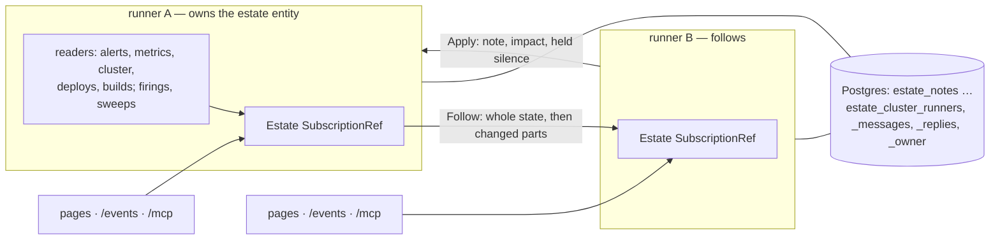

# 0026 — One read, many pages

## Problem

Estate is one process, many browsers. Each process runs every environment's readers on its own schedule, `forEver`,
into its own `SubscriptionRef`, and spec 0010's shared views share that state with every page watching *that
process*. Run two replicas, for a rollout that keeps the page up or a node that can drain, and there are two Estates:
each reads Prometheus, Alertmanager, the cluster, Flux and the CI tools in full, so N replicas are N times the calls,
N times against a Datadog or GitHub rate limit, and N writers of the same firings, sweeps and debug reverts. They do
not even agree. A note or impact written through one replica reaches its database and its own page, but another
replica loads notes only as it starts, so its pages never show it; a silence held on one is not held on the other.
`deploy/deployment.yaml` says `replicas: 1` for these reasons, and whoever wants more than one has nothing to set.

What is wanted is one read of each source, however many replicas serve the pages, and every replica showing the same
estate. Effect already ships what that takes: `effect/cluster` (entities, `Sharding`, `Singleton`, `ClusterCron`, SQL
storage for runners, shard locks and messages) and, in `@effect/platform-bun`, `BunClusterSocket` and
`BunClusterHttp`, at the 4.0.0 Estate pins.

## Not doing

- **A mesh or service discovery.** Runners find each other through the runner and lock tables in Estate's own
  database, as Effect's cluster does; Estate does not become a product for that.
- **Prometheus, Alertmanager or any source made highly available.** Estate reads one address per source, as now.
  Their HA is theirs.
- **Redis, NATS, Dynamo, or another store for the cluster.** Shard locks and runners live in `database.postgres`
  only; Effect's SQL storage there is enough. Dynamo notes stay for single-replica estates; they are not an HA
  option.
- **The catalog, the pages or their UX.** Same pages, same events, same frames; a page cannot tell which replica it
  is attached to.
- **Reads a viewer asks for.** A service's live logs (the log hub), `/api/load` ranges, *Around this alert* and Ask AI
  are read by the replica serving that viewer, on demand, as now. They cost per viewer, not per replica.
- **Changing the default.** Without `cluster: true` Estate is the one process it is today: no Sharding layer, no
  SQL client for it, no extra port.
- **Sharding by environment, yet.** One owner reads every environment first; spreading environments across runners is
  a later entry, the same code with a different key.

## Shape

```yaml
# estate.yaml — that's it for most deploys
cluster: true
database:
  postgres: ${DATABASE_URL}   # Estate's own database, for its notes and history; the cluster shares it
```

Defaults when `cluster: true`: runner address from `POD_IP` (Kubernetes downward API) or the hostname, port
**34431**; listen `0.0.0.0:34431`; health `ping`; `BunClusterSocket` with NDJSON frames (Effect's binary layout cannot
tell apart the unions the state holds), and SQL storage in Estate's Postgres. Notes and the cluster share one
`@effect/sql-pg` pool. Absent or false means one process, exactly as today. Cluster requires `database.postgres`, the
only database that holds the shard locks; `cluster: true` without it, or with DynamoDB, is the settings mistake
`cluster: needs database.postgres, where the runners find each other`.

Override only when you must (a non-default port, or `k8s` health):

```yaml
cluster:
  true                          # or { port: 34431, health: k8s } if you must override
```

Prefer the boolean. A struct is only for overrides. `deploy/cluster` is a kustomize component an overlay adds beside
the base: two replicas, `POD_IP`, port 34431 open between Estate's pods only, and a disruption budget. The overlay's
own `estate.yaml` says `cluster: true` — no mini-mesh to invent.



```text
Estate entity (effect/cluster Entity, one fixed id "estate" for now)
  on start   runs what `background` runs today: startSources, builds, recordFirings + backfill,
             sweepNotes, sweepHistory, debug reverts, against a state of its own; writes its address to
             estate_cluster_owner every 5 s; Entity.keepAlive(true) so it never passivates
  Follow     streaming, volatile: the whole EstateState once, with the owner's address, then each changed part
             (an environment's metrics | alerts | cluster | deploys | costs | resolved | held; builds; notes;
             firings; threads; impacts), compared by reference as stream.ts already compares; the whole again
             when the catalog changes; an empty change every 10 s, and a follower that hears nothing for 30 s
             follows again
  Apply      volatile: a write another runner has made to its tool or database
             (NoteAdded | NoteRemoved | ImpactSet | ImpactCleared | Held | Unheld | ThreadKept | DebugShown),
             applied to the owner's state as one process applies it to its own

Every runner, owner included
  settings read from its own file (sign-in and on-demand reads need them); the catalog comes with the state,
  so every runner shows the owner's, even while a ConfigMap change reaches the pods one by one
  Follow("estate") into its own Estate SubscriptionRef, retried with backOff when the owner moves
  shared views, /events, /readyz, kiosk, /mcp read that SubscriptionRef, unchanged
  /readyz: 503 until the first whole state has arrived; then `ready, reading` or `ready, following <address>`

Without `cluster: true`:
  background runs in-process, as today; no effect/cluster module is loaded
```

```bash
estate doctor
# the cluster
#   cluster  ok    2 runners (10.0.4.12:34431, 10.0.7.3:34431); estate read by 10.0.4.12:34431, beat 4 s ago;
#                  production read by 10.0.7.3:34431, beat 2 s ago   (each environment its own entity: spec 0032)
```

## Why this shape

The owner is an entity with one fixed id rather than a bare `Singleton.make`. Both give exactly one live instance
across the runners, held by a shard lock in SQL and moved when its runner goes; but a singleton has no address, and
the followers need to ask the owner for the state and hand it their writes. An entity is a singleton you can send to:
`Follow` and `Apply` are its RPCs, and `Entity.keepAlive` stops it passivating. Keying it `"estate"` puts every
environment on one owner, which matches today's process and keeps the first change small; keying it by environment
later spreads the readers across runners with no other change, when an estate has enough environments to want it.

The followers receive the *state*, not the frames. Frames are per viewer (whether they may silence, which
environment) and are only some of what is served: `/api/around`, the kiosk, notes, `/readyz` and the MCP tools all
read the `Estate` `SubscriptionRef`. Feeding each runner's `SubscriptionRef` from the owner keeps every route and spec
0010's shared views exactly as they are, so the change is at the edge of the state and nowhere else. Sending frames
over pub/sub was weighed and would need every route rewritten to read frames; recommended: state, changed parts only.

Writes stay where they are taken: a note goes to Postgres, a silence to Alertmanager, from whichever runner the person
reached. What changes is that the runner then tells the owner (`Apply`) rather than its own state, so every runner
sees it on the next `Follow` frame, which fixes the notes that one replica never shows another today.

Storage is the Postgres already holding notes, with `SqlRunnerStorage` and `SqlMessageStorage` under the prefix
`estate_cluster`; its advisory locks are what make the owner single. An advisory lock has no row to read, so the
owner writes its address and the time to `estate_cluster_owner`, and the doctor reads that beside the runners. Runners talk over `BunClusterSocket` on their own
port, which keeps runner RPCs off the ingress that serves the pages; `BunClusterHttp` would share the port and is not
needed. Bun over Node because Estate is Bun throughout.

The point of the opt-in is **one boolean**, not a second product to configure. `cluster: true` turns on the
defaults above; Postgres is the notes database you already have, the runner address is `POD_IP` or the hostname, and
the port is fixed. The Entity / Follow / Apply shape stays; only the operator surface shrinks to a flag.

The cost is still real, and one replica is still the right answer for most estates. Clustering needs
`database.postgres`, port 34431 open between Estate pods, and a failover that takes up to the shard lock's expiry
(35 s by default) plus one read, during which pages show the last state with its age, as they do when a source is
slow. A single replica restarts in about the same time. Recommended: stay on one replica unless the tools' rate
limits are being met by N replicas, a node loss must not blank the page, or the viewers (a wall of kiosks) outgrow
one process.

## Depends on

- **`effect/cluster` and `BunClusterSocket`** at 4.0.0: in the tree now, marked `@stability unstable` (see Open
  questions).
- **`@effect/sql-pg` 4.0.0**, pinned beside `effect`: the `SqlClient` the cluster's storage runs on, speaking
  Postgres's protocol itself, for the notes and the cluster alike: one pool.
- **Spec 0024's `/mcp`** — `/mcp` exists. Every runner serves the same MCP tools from its
  `SubscriptionRef`; they follow for free.

## Stack

One entry per pull request, in build order.

- [x] **`spec-0026`** — this spec, and its row in `specs/README.md` as proposed.
      Done when: `specs/0026-one-read-many-pages.md` is committed and the README lists 0026 as proposed.
- [x] **`cluster-opt-in`** — `cluster: true` (boolean) or a small override struct in the settings;
      `@effect/sql-pg` on `database.postgres`; defaults for runner/`POD_IP`, listen `0.0.0.0:34431`, health `ping`;
      `BunClusterSocket.layer` with SQL storage under `estate_cluster`; the cluster modules loaded only when
      `cluster` is true.
      Done when: settings tests accept `cluster: true` with `database.postgres`; reject `cluster: true` without it
      or with DynamoDB, saying it needs `database.postgres`;
      a test serves with no `cluster` and no database and builds no `Sharding`; `bun run gate` passes unchanged.
- [x] **`scrape-singleton`** — the `Estate` entity, id `"estate"`, running what `background` runs today and kept
      alive; a runner that does not own it runs no readers, sweeps or firing records.
      Done when: under `TestRunner`, the readers start once however many runners follow, and stop when the owning
      shard is released.
- [x] **`view-fanout`** — `Follow`: the whole state, then changed parts; every runner's `Estate` fed from it, retried
      with `backOff`; `/readyz` ready on the first whole state.
      Done when: under `TestRunner`, every follower's state is the owner's, and a follower is not ready before its
      first frame.
- [x] **`writes-to-owner`** — `Apply` for notes, impacts and held silences; the routes tell the owner, not their own
      state, when clustered.
      Done when: a note posted to one runner and a silence held on it are on the other runner's page within one
      frame, without a restart.
- [x] **`doctor-ha`** — `estate doctor` prints a `cluster` line from the runner table and the owner's beat; `/readyz` names the
      role (`reading` or `following <address>`); `estate_cluster_owner` gauge; a log line when the role changes.
      Done when: against two runners, doctor names both and exactly one owner.
- [x] **`cluster-e2e`** — `bun run integration`: Postgres in a container, two Estate processes as runners against
      a Prometheus stub that counts its calls; the owner killed.
      Done when: two runners make no more than half again the calls one makes over the same window; after the owner
      is killed the other reads within 60 s, and its `/readyz` stays ready meanwhile.
- [x] **`deploy-ha`** — `deploy/cluster/`: a component that sets two replicas and `POD_IP`, opens port 34431
      between Estate pods only, and adds a disruption budget; `examples/cluster/` as two runners on one machine that
      differ only in their ports; the README's short "when to bother".
      Done when: an overlay of the base and the component renders with `kubectl kustomize`; the base `deploy/` still
      says `replicas: 1`; the examples read; README "when to bother" stays short.

Later, not in this stack: **`shard-by-environment`**, the entity keyed by environment so each runner reads some.

## Acceptance

```bash
bun run gate
bun run integration     # includes the two-runner case against Postgres
```

```bash
# two runners on one machine, the same database
export DATABASE_URL=postgres://estate@localhost/estate
ESTATE_SETTINGS=examples/cluster/a.yaml bun src/server/main.ts &
ESTATE_SETTINGS=examples/cluster/b.yaml bun src/server/main.ts &
ESTATE_SETTINGS=examples/cluster/a.yaml bun src/server/main.ts doctor     # cluster: 2 runners, estate read by one
```

## Open questions

- **Adopt now, or wait for Cluster to leave `unstable`?** Every cluster module in 4.0.0 is marked
  `@stability unstable`. Recommended: adopt now, behind `cluster: true` only. The default path never loads the cluster
  modules, Effect is pinned exactly, and a breaking 4.x change then costs the opt-in path one PR, not every deploy.
  If the opt-in has no user by the time it is built, park `scrape-singleton` onward rather than carry it.
- **A `Singleton.make` as well as the entity?** Recommended: no. Every serving runner follows, so the entity is always
  woken; a singleton would only matter for a runner that serves nothing, which Estate does not have.
- **How large is a `Follow` frame at a thousand services?** The metrics part changes every read and is most of the
  state. Recommended: changed parts only, numbers to four figures as the services event already sends them; measure
  in `bench` before compressing, and set a budget in spec 0011's style once measured.
- **Two owners for a moment?** A runner cut off from Postgres keeps reading until it notices its lock is gone (up to
  35 s). Reads are harmless twice; firings are upserted by environment, alert and start, sweeps and debug reverts are
  idempotent. Recommended: accept it, rather than fencing every write with the lock.
- **`readOnly: true` with `cluster: true`?** Read-only keeps notes in memory whatever `database` says. Recommended: allow the cluster
  tables in read-only, since they are Estate's own and change nothing in the estate's tools; notes stay in memory.
- **Runner health: `ping` or `k8s`?** Recommended: `ping` when `cluster: true` (works on ECS, a VM, a laptop).
  Override with `cluster: { health: k8s }` only when you want pods to judge runners sooner; `deploy/rbac.yaml` already
  lets Estate get and list pods, so it costs nothing extra in Kubernetes.
